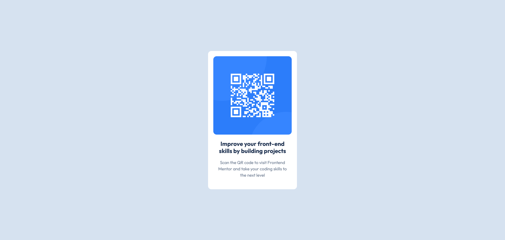

# Frontend Mentor - QR code component solution

This is a solution to the [QR code component challenge on Frontend Mentor](https://www.frontendmentor.io/challenges/qr-code-component-iux_sIO_H). Frontend Mentor challenges help you improve your coding skills by building realistic projects. 

## Table of contents

- [Overview](#overview)
  - [Screenshot](#screenshot)
  - [Links](#links)
- [My process](#my-process)
  - [Built with](#built-with)
  - [What I learned](#what-i-learned)
  - [Continued development](#continued-development)
  - [Useful resources](#useful-resources)
  - [AI Collaboration](#ai-collaboration)
- [Author](#author)


## Overview

### Screenshot

### Mobile


### Desktop



### Links

- Solution URL: https://www.frontendmentor.io/solutions/first-change-with-git--zEQmstvDO
- Live Site URL: https://solefernandez.github.io/qr-code-component-main/

## My process

### Built with

- Semantic HTML5 markup
- CSS custom properties
- Flexbox
- Mobile-first workflow
- CSS Box Model
- Responsive design without media queries
- Normalize.css


### What I learned

This project helped me reinforce several fundamental frontend concepts.


#### Semantic HTML

Instead of focusing only on the visual layout, I learned to think about the semantic structure of the document. One of the main decisions was separating the page layout (`main`) from the card component (`div.contenedor`), giving each element a single responsibility.

```html
<main>
  <div class="contenedor">
    
    <h1 class="titulo">Improve your front-end skills by building projects</h1>
    <p class="instruccion-qr">
      Scan the QR code to visit Frontend Mentor and take your coding skills to the next level
    </p>
  </div>
</main>
```

#### CSS Box Model

I gained a much better understanding of the difference between `margin` and `padding`.

- `padding` creates internal spacing.
- `margin` creates external spacing.

Using `padding` on the card allowed the QR image and text to maintain consistent spacing from the card edges.


#### Responsive Design

One of the most valuable lessons was understanding that not every responsive component requires media queries.

The design keeps the same card size on larger screens while only the surrounding space increases. This behaviour can be achieved with Flexbox and a fixed card width.

```css
main {
    min-height: 100vh;
    display: flex;
    justify-content: center;
    align-items: center;
}

.contenedor {
    width: 27rem;
}
```


#### Viewport Height

I also learned the difference between:

- `height: 100%`
- `min-height: 100vh`

Using `min-height: 100vh` allows the page to fill the viewport while still growing naturally if more content is added later.


### Continued development

In future projects I would like to continue improving:

- HTML semantic structure.
- Responsive layouts.
- Choosing between Flexbox and CSS Grid depending on the problem.
- Understanding when media queries are actually necessary.
- Writing cleaner and more maintainable CSS.


### Useful resources

- [Frontend Mentor](https://www.frontendmentor.io/) - Great platform for practicing real frontend layouts.
- [MDN Web Docs](https://developer.mozilla.org/) - My primary reference for HTML and CSS documentation.
- [Normalize.css](https://necolas.github.io/normalize.css/) - Used to improve browser consistency.

### AI Collaboration

- understand semantic HTML decisions;
- analyse layout strategies before writing CSS;
- understand the CSS Box Model;
- distinguish between `height` and `min-height`;
- reason about responsive behaviour instead of relying immediately on media queries;
- validate design decisions and explain the reasoning behind them.

Rather than requesting complete solutions, I used AI mainly to understand concepts and make informed implementation decisions.


## Author

- GitHub - [SoleFernandez](https://github.com/SoleFernandez)
- Frontend Mentor - [@SoleFernandez](https://www.frontendmentor.io/profile/SoleFernandez)
